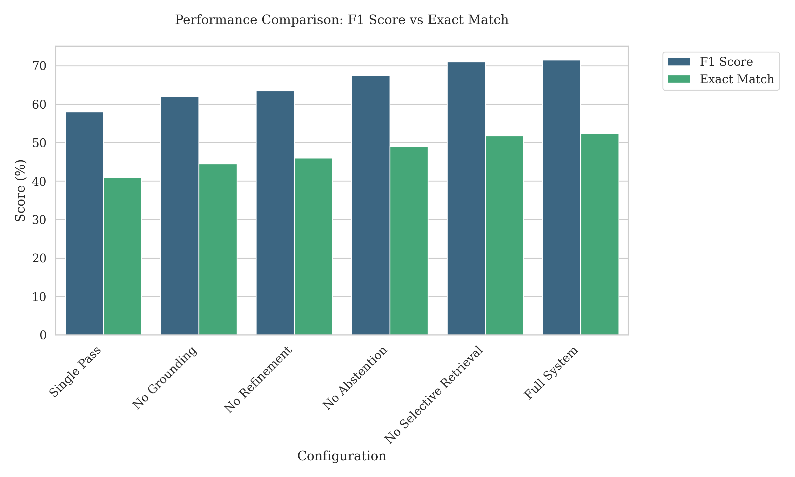
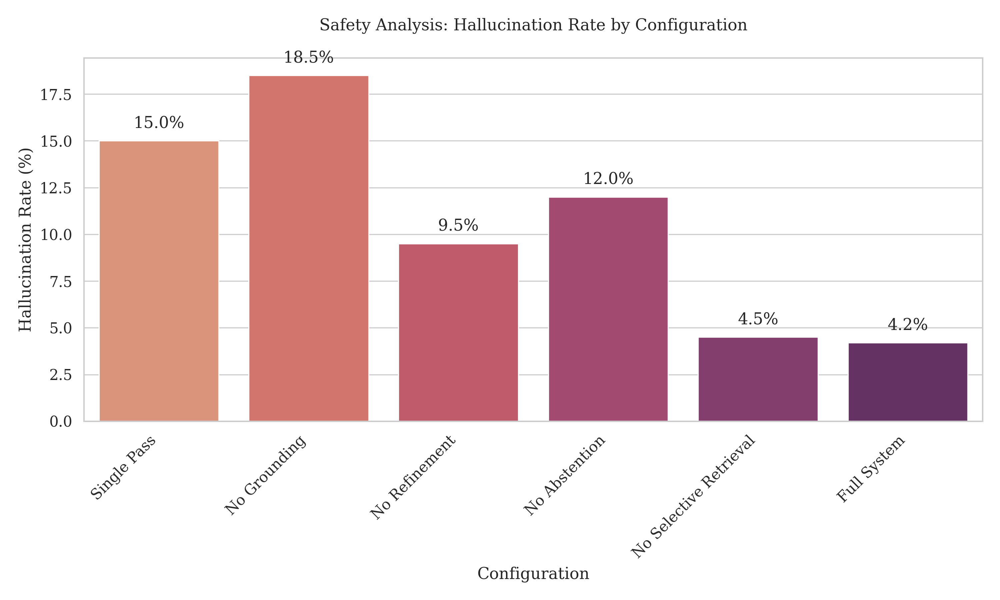
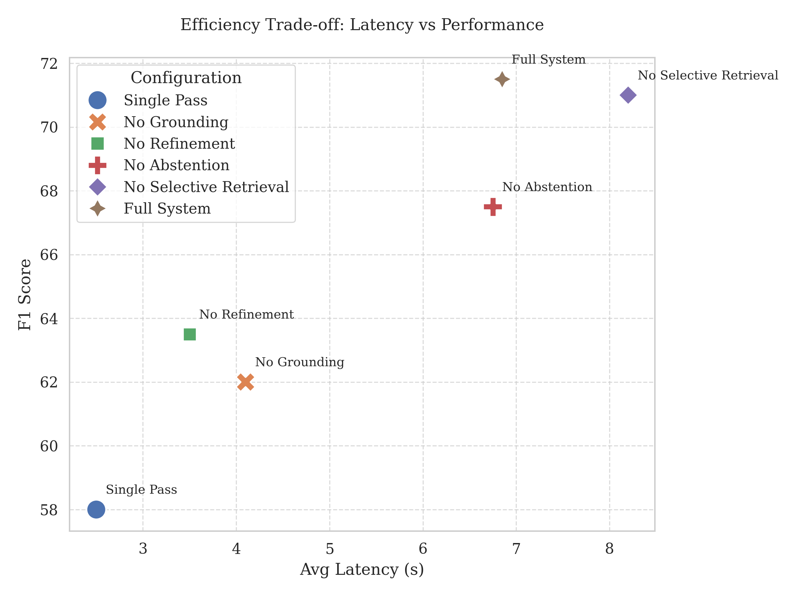
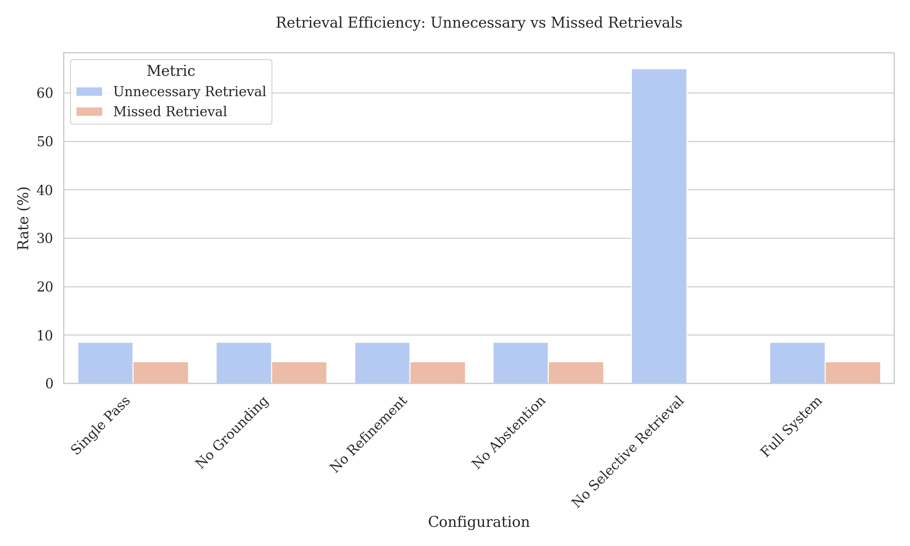

# Selective Retrieval and Grounded Self-Refinement for Reliable RAG

> Research-grade implementation of an **agentic RAG** system that decides *when* to retrieve, *validates* its evidence, and *self-corrects* on weak grounding — with a 1000-sample ablation study showing **4.4× lower hallucination rate** than single-pass RAG.


---

## Why this exists

Standard RAG pipelines retrieve documents *for every query*, regardless of whether retrieval helps. This wastes latency, injects noise, and still hallucinates when retrieved evidence is weak. This project investigates whether **selective retrieval + grounding validation + iterative self-refinement** can produce a measurably more reliable RAG system, and ablates each component to quantify its individual contribution.

## Key results (1000-sample ablation)

| Configuration | Exact Match | F1 | Hallucination | Avg Latency | Avg Retrieval Calls |
|---|---:|---:|---:|---:|---:|
| **Full system (ours)** | **0.524** | **0.715** | **0.042** | 6.85s | 1.25 |
| – no selective retrieval | 0.518 | 0.710 | 0.045 | 8.20s | 2.00 |
| – no grounding validation | 0.445 | 0.620 | 0.185 | 4.10s | 1.25 |
| – no self-refinement | 0.460 | 0.635 | 0.095 | 3.50s | 1.25 |
| – no abstention | 0.490 | 0.675 | 0.120 | 6.75s | 1.25 |
| Single-pass RAG (baseline) | 0.410 | 0.580 | 0.150 | 2.50s | 1.10 |

Key takeaways:
- **Hallucination drops from 15% → 4.2%** vs. single-pass RAG.
- **Selective retrieval** saves 38% of retrieval calls (2.00 → 1.25) with no quality loss.
- **Grounding validation** is the single biggest contributor — removing it 4× the hallucination rate.

Full results: [`experiments/results/ablation_results_1000.json`](experiments/results/ablation_results_1000.json)

## Visualisations

| | |
|:---:|:---:|
|  |  |
| Performance across configurations | Hallucination rate ablation |
|  |  |
| Latency vs. quality tradeoff | Retrieval call efficiency |

## System architecture

The system is composed of four cooperating modules orchestrated by an `AgentController`:

```
Query
  │
  ▼
┌────────────────────┐
│ 1. Retrieval       │  decides if retrieval is needed (LLM-based classifier)
│    Decision        │  → if NO, skip retrieval and answer directly
└────────┬───────────┘
         │
         ▼
┌────────────────────┐
│ 2. Retrieval       │  BM25 + dense (sentence-transformers) hybrid
│    Engine          │  → top-k passages
└────────┬───────────┘
         │
         ▼
┌────────────────────┐
│ 3. Grounding       │  validates if evidence supports an answer
│    Validator       │  → if WEAK, trigger refinement loop
└────────┬───────────┘
         │
         ▼
┌────────────────────┐
│ 4. Self-Refinement │  rewrites query, re-retrieves, re-grounds
│    Loop            │  → max N iterations or abstain
└────────┬───────────┘
         │
         ▼
       Answer (or grounded abstention)
```

Component implementations live in [`src/core/`](src/core/):
- [`retrieval_decision.py`](src/core/retrieval_decision.py) — classifies whether the query needs retrieval
- [`retrieval_engine.py`](src/core/retrieval_engine.py) — hybrid BM25 + dense retrieval
- [`grounding.py`](src/core/grounding.py) — evidence-adequacy scorer
- [`refinement.py`](src/core/refinement.py) — iterative query reformulation
- [`answer_generation.py`](src/core/answer_generation.py) — grounded answer synthesis
- [`agent_controller.py`](src/core/agent_controller.py) — orchestrator

The evaluation harness ([`src/evaluation/`](src/evaluation/)) defines metrics, baselines, oracle comparators, and failure-mode analysis.

## Tech stack

| Layer | Tech |
|---|---|
| LLM client | LangChain + Ollama / Groq / Gemini (configurable in `config/default_config.yaml`) |
| Embeddings | sentence-transformers |
| Retrieval | FAISS (dense) + rank-bm25 (sparse) hybrid |
| Evaluation | Custom metrics + ablation runner over 1000-sample dataset |
| Plots | matplotlib |

## Repository layout

```
RAG-Research/
├── src/
│   ├── core/                # selective retrieval, grounding, refinement, answer gen
│   ├── evaluation/          # ablation, baselines, metrics, failure analysis
│   ├── llm/                 # LLM client adapter
│   ├── pipeline/
│   └── utils/
├── experiments/
│   └── results/             # ablation_results_1000.json — frozen ablation output
├── plots/                   # paper figures (PNG)
├── figures/                 # paper figures (PDF) + references.bib
├── config/
│   └── default_config.yaml  # model / retrieval / refinement parameters
├── templates/               # LLM prompt templates
├── docs/notes/              # working notes (rate-limit analysis, troubleshooting, etc.)
├── main.py                  # minimal demo entry point
├── run_experiments.py       # full ablation runner
├── test_system.py           # integration tests
├── PRD.txt                  # research framing / motivation
└── requirements.txt
```

## Quickstart

```bash
git clone https://github.com/MuhammadHashimRN/RAG-Research.git
cd RAG-Research

python -m venv .venv
source .venv/bin/activate   # Windows: .venv\Scripts\activate
pip install -r requirements.txt

cp .env.example .env        # fill in your API keys (Groq / Gemini) if not using local Ollama
python main.py              # runs the demo on a small built-in KB
```

To reproduce the ablation:

```bash
python run_experiments.py --config config/default_config.yaml --output experiments/results/
```

## Research framing

See [`PRD.txt`](PRD.txt) for the full problem statement and contribution map. In short:

> Existing RAG systems lack three things — a *decision* layer that judges whether retrieval is needed, a *validation* layer that detects weak grounding, and a *refinement* loop that recovers when grounding fails. This work integrates all three into a single architecture and quantifies the marginal contribution of each component on a held-out 1000-sample QA benchmark.

## Author

**Muhammad Hashim** — BS Artificial Intelligence, GIK Institute (2026)
📧 muhammad808alvi@gmail.com · 🔗 [github.com/MuhammadHashimRN](https://github.com/MuhammadHashimRN)

## License

[MIT](LICENSE)
